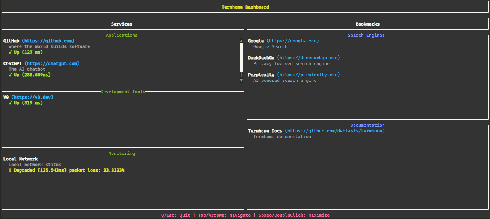

# TermHome 🐚

[](https://go.dev/dl/)

A beautiful terminal homepage application powered by [tview](https://github.com/rivo/tview).



## Overview

Termhome is a terminal-based dashboard that displays services, bookmarks, and Docker containers in an organized, interactive interface:

- Beautiful, modern terminal interface
- Service monitoring with status indicators
- Bookmark management
- Docker container integration
- Compatible with [gethomepage.dev](https://gethomepage.dev/) configuration format

## Installation

```bash
# From source
go install github.com/deblasis/termhome@latest

# Or download the binary from releases
```

## Usage

```bash
# Run with default configuration
termhome

# Run with custom configuration directory
termhome --config-dir /path/to/config --log-level INFO

# Generate example configuration files
termhome init
```

### Command Line Arguments

- `--config-dir`: Directory containing the configuration files (settings.yaml, services.yaml, bookmarks.yaml, docker.yaml) (default: "./config")
- `--log-level`: Log level (DEBUG, INFO, WARN, ERROR, FATAL) (default: "INFO")

### Subcommands

- `init`: Initialize example configuration files in the specified directory
  - `--config-dir`: Directory to create example configuration files in (default: "./config")

### Configuration Files

Termhome uses the same configuration format as [gethomepage.dev](https://gethomepage.dev/):

- `settings.yaml`: Basic settings (title, etc.)
- `services.yaml`: Service definitions with status monitoring
- `bookmarks.yaml`: Bookmark links
- `docker.yaml`: Docker container configuration

For detailed configuration options, see the [gethomepage.dev configuration docs](https://gethomepage.dev/configs/settings/).

## Key Controls

- `Tab`: Navigate between elements
- `Arrow keys`: Navigate within elements
- `Enter`: Select/activate element
- `Q` or `Esc`: Quit the application

## Status Indicators

Services show status indicators with colors representing the current state:

- Green: OK
- Yellow: Warning
- Red: Critical
- Gray: Unknown

## Contributing

Contributions are welcome! Please feel free to submit a Pull Request.

## License

This project is licensed under the MIT License - see the LICENSE file for details.
